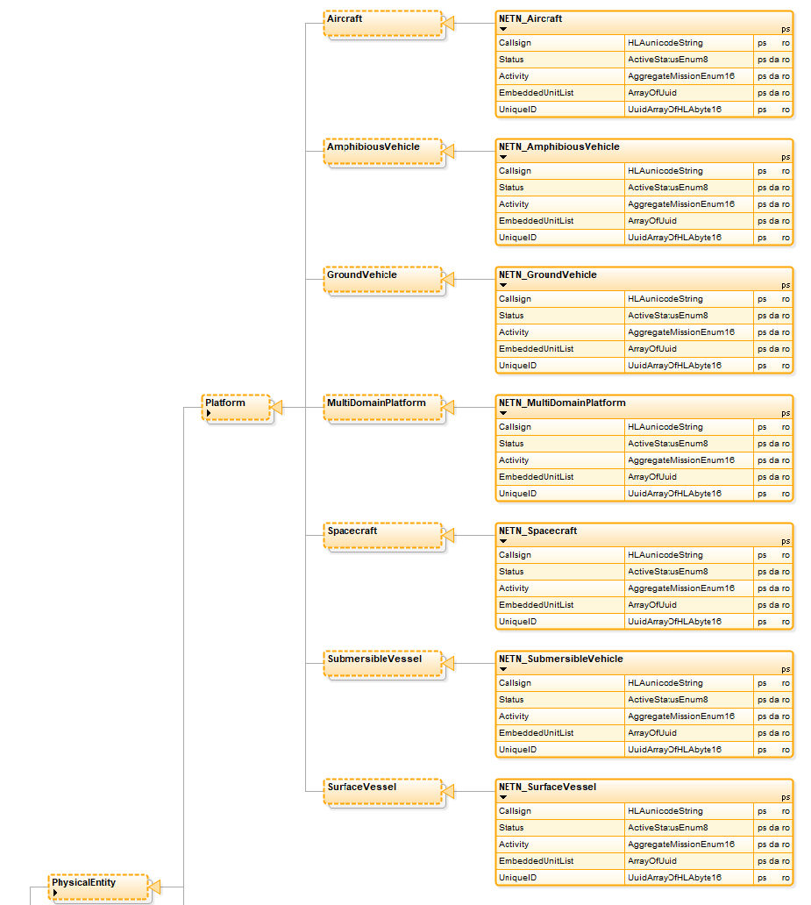
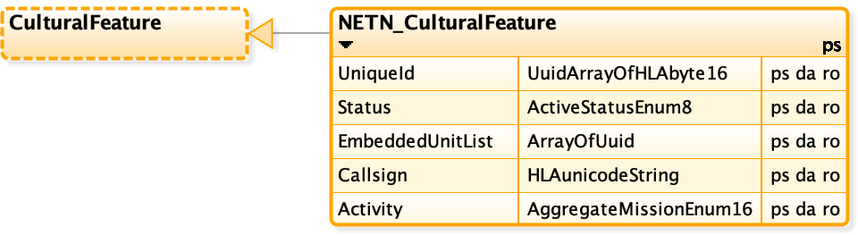
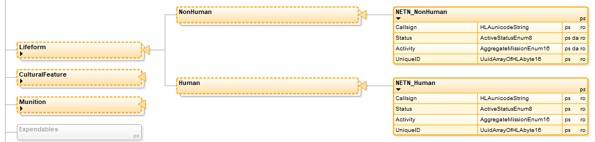
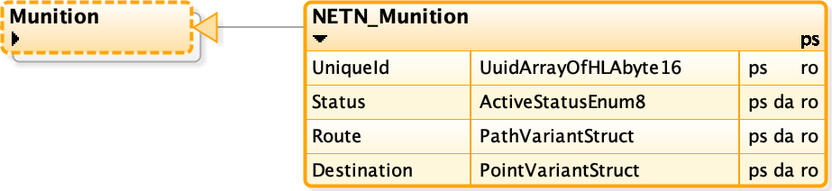
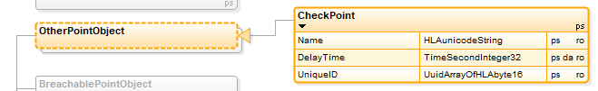

The NATO Education and Training Network (NETN) Physical FOM Module.

Copyright (C) 2020 NATO/OTAN.
This work is licensed under a [Creative Commons Attribution-NoDerivatives 4.0 International License](LICENCE.md).

## Introduction

The NETN FAFD representation of physical entities such as platforms is based on the [SISO-STD-001-2015 standard RPR-FOM v2.0](https://www.sisostds.org/). The NETN FOM Module extends the RPR-FOM object classes representing physical entities with subclasses which include additional attributes for e.g unique identification of simulated entities.

It is recommended that NETN federates support NETN extensions of Physical Entities. For compatibility reasons, NETN federates, that implement NETN extensions of RPR-FOM Physical Entities, are also required to support RPR-FOM v2.0.

### Purpose

The NETN-Physical FOM Module provides a common standard interface for the representation of Physical Entities in a federated distributed simulation. The module extends the existing RPR-FOM v2.0 standard with subclasses classes and additional attributes to allow additional information to be associated with simulated physical entities.

A unique identification attribute has been included to provide better support for initialization, NETN-TMR and other advanced design patterns requiring unique pre-defined identifiers for simulated entities. NETN federations still allow pure RPR-FOM based federates in the federation but with limited ability to interoperate in some NETN design aspects. 

### Scope

#### Attribute Table for NETN_Aircraft, NETN_AmphibiousVehicle, NETN_GroundVehicle, NETN_MultiDomainPlatform, NETN_Spacecraft, NETN_SubmersibleVehicle, NETN_SurfaceVessel, and NETN_CulturalFeature

The relation to NETN-ORG is not a one-to-one mapping, excepted for some cases.

|Attribute|Description|NETN-ORG Relation|
|---|---|---|
|Callsign|The name of the object.|Unit.Name|
|Status|If an instance shall be taken into account by federates.|-|
|Activity|The activity of the object.|-|
|EmbeddedUnitList|List of unique IDs of on-board elements.|Unit.EmbarkedIn (indirect)|
|UniqueID|The unique identifier of the object. Required value. If not assigned by the ORBAT specification or similar, shall a value be assigned, either randomized or generated from the Marking or EntityIdentifier attribute value.|Unit.UUID|
|Marking|RPR_v2 attribute|Unit.Name|
|EntityType|RPR_v2 attribute|Unit.EntityType|
|ForceIdentifier|RPR_v2 attribute|Unit.Force|
|Spatial|RPR_v2 attribute|Unit.Location, Unit.Direction, Unit.Speed|
|IsPartOf|RPR_v2 attribute|Unit.EmbarkedIn|
|DamageState|RPR_v2 attribute|Unit.CombatEffectiveness|

#### Attribute Table for NETN_Human and NETN_NonHuman

|Attribute|Description|NETN-ORG Relation|
|---|---|---|
|Callsign|The name of the object.|Unit.Name|
|Status|If an instance shall be taken into account by federates.|-|
|Activity|The activity of the object.|-|
|UniqueID|The unique identifier of the object. Required value. If not assigned by the ORBAT specification or similar, shall a value be assigned, either randomized or generated from the Marking or EntityIdentifier attribute value.|Unit.UUID|
|Marking|RPR_v2 attribute|Unit.Name|
|EntityType|RPR_v2 attribute|Unit.EntityType|
|ForceIdentifier|RPR_v2 attribute|Unit.Force|
|Spatial|RPR_v2 attribute|Unit.Location, Unit.Direction, Unit.Speed|
|IsPartOf|RPR_v2 attribute|Unit.EmbarkedIn|
|DamageState|RPR_v2 attribute|Unit.CombatEffectiveness|

#### Attribute Table for NETN_Munition

|Attribute|Description|NETN-ORG Relation|
|---|---|---|
|Status|If an instance shall be taken into account by federates.|-|
|UniqueID|The unique identifier of the object. Required value. If not assigned by the ORBAT specification or similar, shall a value be assigned, either randomized or generated from the Marking or EntityIdentifier attribute value.|Unit.UUID|
|Marking|RPR_v2 attribute|Unit.Name|
|EntityType|RPR_v2 attribte|Unit.EntityType|
|ForceIdentifier|RPR_v2 attribute|Unit.Force|
|Spatial|RPR_v2 attribute|Unit.Location, Unit.Direction, Unit.Speed|
|IsPartOf|RPR_v2 attribute|Unit.EmbarkedIn|
|DamageState|RPR_v2 attribute|Unit.CombatEffectiveness|

#### Attribute Table for CheckPoint

|Attribute|Description|NETN-ORG Relation|
|---|---|---|
|Name|Name of the Check Point.|-|
|DelayTime|The time that an entity shall wait, the total wait time can be greater when it is a queue. This is a nominal value, federates can use this for modifing delay time for different types if entities, e.g add or subtract a value or multiply with a type depending factor.|-|
|UniqueID|The unique identifier of the object. Required value. If not assigned by the ORBAT specification or similar, shall a value be assigned, either randomized or generated from the Marking or EntityIdentifier attribute value.|-|

