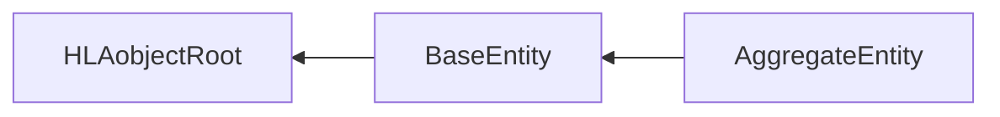

# NETN-Physical
|Version| Date| Dependencies|
|---|---|---|
|v3.0|2023-04-11|NETN-BASE, RPR-Physical, RPR-Aggregate|

The NETN-Physical FOM Module provides a standard interface for representing simulation entities in a federated distributed simulation. The module extends the RPR-FOM standard SISO-STD-001-2015 with additional attributes for simulated physical and aggregated entities.

The specification is based on IEEE 1516 High Level Architecture (HLA) Object Model Template (OMT) and supports interoperability in a federated simulation (federation) based on HLA.

For backward compatibility, published objects should include all required RPR-FOM attributes.

## Object Classes

Note that inherited and dependency attributes are not included in the description of object classes.

### BaseEntity

A base class of aggregate and discrete scenario domain participants. The BaseEntity class is characterized by being located at a particular location in space and independently movable, if capable of movement at all. It specifically excludes elements normally considered to be a component of another element. The BaseEntity class is intended to be a container for common attributes for entities of this type. Since it lacks sufficient class specific attributes that are required for simulation purposes, federates cannot publish objects of this class. Certain simulation management federates, e.g. viewers, may subscribe to this class. Simulation federates will normally subscribe to one of the subclasses, to gain the extra information required to properly simulate the entity.

|Attribute|Datatype|Semantics|
|---|---|---|
|SymbolId|SymbolIdentifier|Optional. A symbol identifier. If not provided, derive the default value from the `BaseEntity` attribute `EntityType` and `PhysicalEntity` or `AggregateEntity` attribute `ForceIdentifier`.|
|SymbolAmplification|SymbolAmplificationVariant|Optional: Additional symbol amplification data.|
|Callsign|Text21|Optional: The callsign is the unique-designator symbol-amplifier. The default is using the RPR-FOM `PhysicalEntity` attribute `Marking` or the `AggregateEntity` attribute `AggregateMarking`.|
|HostEntity|UUID|Optional. Reference to the simulation entity this platform is mounted on or embedded in. The default is no host entity (all zeros UUID).|
|HostedEntities|ArrayOfUuid|Optional. Reference to simulation entities mounted on or embedded in a `CulturalFeature`, `Platform`, or `AggregateEntity` simulation entity.|

### AggregateEntity

A group of one or more separate objects that operate together as part of an organization. These objects may be discrete, may be other aggregate objects, or may be a mixture of both.

|Attribute|Datatype|Semantics|
|---|---|---|
|SuppliesStatus|SupplyStructArray|Optional. The type and total quantities of supply holdings modelled by this entity.|
|EquipmentStatus|ArrayOfResourceStatus|Optional. The total amount and status of equipment holdings represented by this entity.|
|PersonnelStatus|ArrayOfResourceStatus|Optional. The total amount and status of all personnel holdings modelled by this entity.|
|VisualSignature|VisualSignatureStruct|Optional: Describes the susceptibility to electro-optical detection.|
|HUMINTSignature|HUMINTSignatureStruct|Optional: Describes the susceptibility to human intelligence (HUMINT), i.e. information collected and provided by human sources.|
|ElectronicSignature|ElectronicSignatureStruct|Optional: Describes the susceptibility to electronic detection both as a summary value and by identifying aggregate sensors together with their operational status.|
|CombatValue|PercentFloat32|Optional. A summary value of the effectiveness (the level of training, leadership, morale, personnel and equipment operational status). The default value is 100%.|
|CoverStatus|PercentFloat32|Optional. The cover status describes the entity's protection from the effects of weapons fire. The default is 0% - fully affected by weapon fire.|
|CaptureStatus|CaptureStatusEnum8|Optional: The status of an entity's level of control or influence over its activities. The default is Not-Captured.|
|Echelon|EchelonEnum32|Optional. Use the echelon symbol-modifier to specify the size of the AggregateEntity (level of command).|
|WeaponsControlOrder|WeaponControlOrderEnum8|Optional. Describes current Weapon Control Order as Free, Tight, or Hold. The default is 0 - Other.|

## Datatypes

Note that only datatypes defined in this FOM Module are listed below. Please refer to FOM Modules on which this module depends for other referenced datatypes.

### Overview
|Name|Semantics|
|---|---|
|ArrayOfEntityStruct|Data for one or more entities that comprise an entity list.|
|ArrayOfResourceStatus|The array of health states for a named resource.|
|ArrayOfSensorStruct|Array with definitio0ns of sensors, 1+ cardinality|
|CaptureStatusEnum8|The status of a simulated entity concerning their control or influence over their activities.|
|ConcealmentEnum32|The type of concealment.|
|ElectronicSignatureStruct|An entity's susceptibility to detection of its electronic emissions.|
|EntityCategoryEnum32|Category of entity|
|EntityStruct|An entity represented to the federation as part of the aggregate object which owns it.|
|HUMINTSignatureStruct|Describes the entity's susceptibility to human intelligence (HUMINT), i.e. information collected and provided by human sources.|
|RangeFloat32|Range of sensor|
|ResourceStatusStruct|The name of a resource and the number of instances of that resource by health status.|
|SensorStateEnum32|The emission states of aggregate sensors|
|SensorStruct|Defines a sensor's operational status, damage status, and coverage.|
|VisualSignatureStruct|Specifies the visual structure|
|WeaponControlOrderEnum8|The enumerations for weapon control|
        
### Simple Datatypes
|Name|Units|Semantics|
|---|---|---|
|RangeFloat32|meters|Range of sensor|
        
### Enumerated Datatypes
|Name|Representation|Semantics|
|---|---|---|
|CaptureStatusEnum8|HLAoctet|The status of a simulated entity concerning their control or influence over their activities.|
|ConcealmentEnum32|RPRunsignedInteger32BE|The type of concealment.|
|EntityCategoryEnum32|RPRunsignedInteger32BE|Category of entity|
|SensorStateEnum32|RPRunsignedInteger32BE|The emission states of aggregate sensors|
|WeaponControlOrderEnum8|HLAoctet|The enumerations for weapon control|
        
### Array Datatypes
|Name|Element Datatype|Semantics|
|---|---|---|
|ArrayOfEntityStruct|EntityStruct|Data for one or more entities that comprise an entity list.|
|ArrayOfResourceStatus|ResourceStatusStruct|The array of health states for a named resource.|
|ArrayOfSensorStruct|SensorStruct|Array with definitio0ns of sensors, 1+ cardinality|
        
### Fixed Record Datatypes
|Name|Fields|Semantics|
|---|---|---|
|ElectronicSignatureStruct|ElectronicSignaturePercent, SensorArray|An entity's susceptibility to detection of its electronic emissions.|
|EntityStruct|Callsign, EntityCategory, EntityStatus, IsDistinctObject, IsUnavailable, Facing, Concealment, OffsetLocation, Allocation|An entity represented to the federation as part of the aggregate object which owns it.|
|HUMINTSignatureStruct|HUMINTSignaturePercent|Describes the entity's susceptibility to human intelligence (HUMINT), i.e. information collected and provided by human sources.|
|ResourceStatusStruct|NumberHealthyOrIntact, NumberSlightlyDamaged, NumberModeratelyDamaged, NumberSignificantlyDamaged, NumberDestroyed, ResourceName, ResourceType|The name of a resource and the number of instances of that resource by health status.|
|SensorStruct|SensorStateEnum, SensorDamageState, SensorCoverage, SensorID|Defines a sensor's operational status, damage status, and coverage.|
|VisualSignatureStruct|DVOSignaturePercent, I2SignaturePercent, ThermalSignaturePercent|Specifies the visual structure|
    