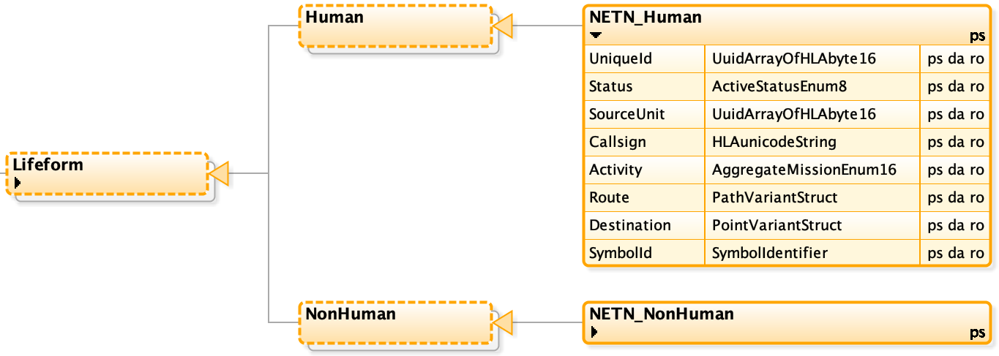
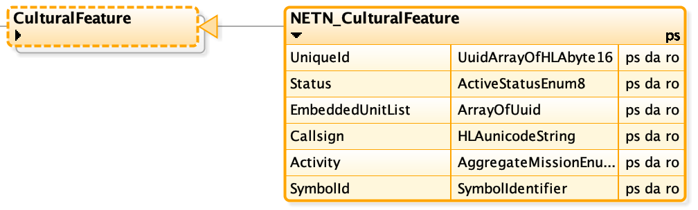

The NATO Education and Training Network (NETN) Physical FOM Module.

Copyright (C) 2020 NATO/OTAN.
This work is licensed under a [Creative Commons Attribution-NoDerivatives 4.0 International License](LICENCE.md).

## Introduction

The NETN FAFD representation of physical entities such as platforms is based on the [SISO-STD-001-2015 standard RPR-FOM v2.0](https://www.sisostds.org/). The NETN FOM Module extends the RPR-FOM object classes representing physical entities with subclasses which include additional attributes for e.g unique identification of simulated entities.

It is recommended that NETN federates support NETN extensions of Physical Entities. For compatibility reasons, NETN federates, that implement NETN extensions of RPR-FOM Physical Entities, are also required to support RPR-FOM v2.0.

### Purpose

The NETN-Physical FOM Module provides a common standard interface for the representation of Physical Entities in a federated distributed simulation. The module extends the existing RPR-FOM v2.0 standard with subclasses classes and additional attributes to allow additional information to be associated with simulated physical entities.

### Scope

All RPR-FOM Physical Entity object classes have been extended with additional attributes to support NETN based federation. This includes a unique identifier that provide better support for initialization, NETN-TMR and other advanced design patterns requiring unique pre-defined identifiers for simulated entities. NETN federations still allow pure RPR-FOM based federates in the federation but with limited ability to interoperate in some NETN design aspects. 

## Platforms Entities

Figure: NETN Extensions to RPR-FOM Platform object classes

All RPR-FOM Platform object classes are extended with subclasses and the same set of additional attributes.

|Attribute|Description|
|---|---|
|UniqueID|**Required**: The unique identifier of the object. Required value. If not assigned by the ORBAT specification or similar, shall a value be assigned, either randomized or generated from the Marking or EntityIdentifier attribute value.|
|Status|**Required:** Indicate if this aggregate unit currently is being simulated or not. E.g. units mounted or embarked on transports can be set to inactive. During inactive state the attribute values may not reflect an accurate current value. Therefore, any subscribing federate can ignore inactive units. All attributes must be updated to represent the current status of the instance before status is set to Active.|
|SourceUnit|**Optional:** Reference to an active NETN_Aggregate instance from which this physical entity was divided. If not published, merging is not supported. Default value is 0000000000000000 representing no source unit.|
|EmbeddedUnitList|**Optional:** A list referencing units and/or platforms embarked on and transported by this unit. If not published, transport of embedded units not supported. Default is an empty list.|
|Callsign|**Required:** A callsign used to address the unit. Callsigns should be unique in the context in which they are used but not required to be globally unique.|
|Activity|**Optional:** The current activity of the platform. This may differ from the mission due to casualties, readiness, etc. Default is 0 (Other activity).|

## Lifeform Entities

|Attribute|Description|
|---|---|
|UniqueID|**Required**: The unique identifier of the object. Required value. If not assigned by the ORBAT specification or similar, shall a value be assigned, either randomized or generated from the Marking or EntityIdentifier attribute value.|
|Status|**Required:** Indicate if this aggregate unit currently is being simulated or not. E.g. units mounted or embarked on transports can be set to inactive. During inactive state the attribute values may not reflect an accurate current value. Therefore, any subscribing federate can ignore inactive units. All attributes must be updated to represent the current status of the instance before status is set to Active.|
|SourceUnit|**Optional:** Reference to an active NETN_Aggregate instance from which this physical entity was divided. If not published, merging is not supported. Default value is 0000000000000000 representing no source unit.|
|Callsign|**Required:** A callsign used to address the unit. Callsigns should be unique in the context in which they are used but not required to be globally unique.|
|Activity|**Optional:** The current activity of the platform. This may differ from the mission due to casualties, readiness, etc. Default is 0 (Other activity).|

## Cultural Features

|Attribute|Description|
|---|---|
|UniqueID|**Required**: The unique identifier of the object. Required value. If not assigned by the ORBAT specification or similar, shall a value be assigned, either randomized or generated from the Marking or EntityIdentifier attribute value.|
|Status|**Required:** Indicate if this aggregate unit currently is being simulated or not. E.g. units mounted or embarked on transports can be set to inactive. During inactive state the attribute values may not reflect an accurate current value. Therefore, any subscribing federate can ignore inactive units. All attributes must be updated to represent the current status of the instance before status is set to Active.|
|EmbeddedUnitList|**Optional:** A list referencing units and/or platforms embarked on and transported by this unit. If not published, transport of embedded units not supported. Default is an empty list.|
|Callsign|**Required:** A callsign used to address the unit. Callsigns should be unique in the context in which they are used but not required to be globally unique.|
|Activity|**Optional:** The current activity of the platform. This may differ from the mission due to casualties, readiness, etc. Default is 0 (Other activity).|

## Munition Entities

|Attribute|Description|
|---|---|
|UniqueID|**Required**: The unique identifier of the object. Required value. If not assigned by the ORBAT specification or similar, shall a value be assigned, either randomized or generated from the Marking or EntityIdentifier attribute value.|
|Status|**Required:** Indicate if this aggregate unit currently is being simulated or not. E.g. units mounted or embarked on transports can be set to inactive. During inactive state the attribute values may not reflect an accurate current value. Therefore, any subscribing federate can ignore inactive units. All attributes must be updated to represent the current status of the instance before status is set to Active.|

